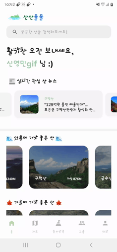

# :office:Team Sansantek

+ ## :mountain:Project SanSanMulMul
  바쁘거나, 아는 사람이 별로 없거나, 등산을 좋아하는 사람들이 없는 등의 이유로 같이 등산을 할 사람을 구하기가 어려운 사람들을 위한 어플 산산물물!

+ ## :sparkles:Service Example
  + 1️⃣ 홈 및 산 뉴스
    + 홈에서 날짜에 따른 계절별 산 추천 (봄이면 봄 여름 가을 겨울, 여름이면 여름 가을 겨울 봄 등의 순으로)
    + 상단 뉴스 탭에서 뉴스를 누를 시 해당 뉴스 링크로 이동
    + 
  + 2️⃣ 지도 탭
    + 최초 실행 시 자신의 위치를 기반으로 근처 50KM 범위에 해당하는 산의 리스트를 하단 Botton Drawer에 보여주고, Naver Map에 Marker로 표시해줌
    + 마커를 누를 시 산 이름을 Tag로 보여줌
    + 지도를 직접 움직일 경우 해당 화면 영역 근처 50KM내의 산의 리스트를 보여줌
    + 
  + 3️⃣ 그룹 탭 및 그룹 검색
    + 나의 그룹과, 전체 그룹에 대해서 선택할 수 있는 Radio 버튼이 있고, 나의 그룹에서는 진행 중인 그룹과 완료된 그룹에 대해서 볼 수 있는 Spinner가 제공
    + 상단의 검색 탭, Spinner의 조건을 설정할 경우 각 경우에 맞는 그룹이 필터링 되어서 보여짐
    + 
  + 4️⃣ 그룹 신청
    + 가입 신청 버튼을 누르면 해당 방의 방장 및 등산 스타일 등 보다 구체적인 정보를 알 수 있음
    + 가입 신청을 누르면 신청 완료 다이얼로그를 보여줌
    + 만약 이미 내가 가입한 그룹과 시간이 겹치거나, 이미 신청한 적이 있는 그룹의 경우 각각의 상황에 맞는 가입 불가 다이얼로그를 띄워줌
    + 
      |그룹 신청|그룹 신청 불가 다이얼로그|
      |:---:|:---:|
      |||
  + 5️⃣ 그룹 신청 Notification
    + 누군가가 내가 개설한 방에 가입 신청을 누른다면 FCM을 통해 Notification을 띄워서 알려줌
    + 
  + 6️⃣ 그룹 가입 신청 수락 및 거절
    + 방장은 신청과 거절 버튼을 통해 멤버를 골라 받을 수 있음
    + 버튼을 누를 때마다 수락이라면 해당 유저가 바로 그룹 멤버로 반영됨
    + 
  + 7️⃣ 그룹 채팅
    + Stomp 방식으로 실시간 채팅을 구현함
    + 이 또한 FCM 알림이 오도록 구현함
    + 
  + 8️⃣ 산 검색 및 디테일
    + 홈 탭의 상단에 검색 창을 통해서 특정 산을 검색할 수 있음
    + 검색 시 나오는 산 검색 결과 창, 지도 탭의 Bottom Drawer 등 산 정보가 나오는 곳곳에서 산을 누를 시, 구체적인 산에 대한 정보를 볼 수 있는 Detail 창으로 넘어감
    + Detail 창에서 해당 산의 오늘부터 5일간의 기상 예보, 산에 대한 설명, 코스 개수, 고도, 일출, 일몰 시간, 코스 종류 및 코스 경로 등 다양한 기능을 보여줌
    + 
      |산 검색|산 디테일|
      |:---:|:---:|
      |||
  + 8️⃣그룹 디테일
    + 그룹 설명, 멤버 등 그룹에 대한 정보와, 상행, 하행 등산 코스에 대한 정보 및 갤러리 기능을 제공함
    + 갤러리는 자신의 사진에 한해서만 삭제가 가능함
    + 또한 그룹 신청 요청 및 방장 위임 등 이벤트에 대한 알림 목록을 제공함. 이때 사람 정보 등 특정 정보를 필터링하여 하이라이트 처리해서 보여줌
    + 
      |그룹 디테일 및 사진 첨부|그룹 갤러리|알림 목록|
      |:---:|:---:|:---:|
      ||||
  + 9️⃣마이 페이지
    + 내 닉네임, 프로필 사진, 칭호, 정상석 인증 리스트 등을 확인할 수 있음
    + 또한 
      |마이페이지, 정상석, 팔로잉 팔로우|프로필 수정|
      |:---:|:---:|
      |||
  + 🔟등산 기록
    + 시간이 되면, 등산 기록 탭에서 방장은 QR이 생성되고, 그룹의 멤버는 QR을 찍어서 등산 기록 시작
    + 등산 시작을 누르면 기록이 시작되고, QR을 찍은 멤버들 간 위치가 공유됨
    + 이 때 혼자서 200m 이상 이탈된 멤버가 있다면 전체에게 FCM 알림 및 이탈 다이얼로그가 생성됨
    + 또한 나의 등산 기록은 시간별 위치가 Android 내부 Room에 저장되어 추후 마이페이지의 등산 History에서 나의 동선을 확인할 수 있음
    + AI를 통한 정상석을 판별하는 기능을 통해 정상에 올랐을 때 정상석을 인증할 수 있는 기능 제공 및 추후 마이페이지의 My 정상석 탭에서 인증된 정상석 확인 가능
    + |방장 QR|멤버 위치 제공 및 이탈 감지|정상석 인증|
      |:---:|:---:|:---:|
      ||||

  

+ ## :pouting_man::pouting_woman:Member
    |윤가희|노나현|박태우|신영민|정민선|곽대건|
    |:---:|:---:|:---:|:---:|:---:|:---:|
    |**Team Leader / BE**|**BE / CI,CD**|**BE**|**FE**|**FE / UI,UX**|**FE**|
    | yungahee99@gmail.com| hyunstu16@gmail.com| twey163@gmail.com| 2525sym@gmail.com| alstjs1516@gmail.com| eorjs7578@gmail.com|

 

+ ## :date:Milestone
  
+ ## :open_book:Stack
  + ### :computer:Back Tech Stack
    
    
    
    
    
    
    

  + ### :iphone:Android Tech Stack
    
    
    
    
    
    
    
    
    
    
    
    
    
    
  + ### :art:UI/UX
    
    

    
  + ### :desktop_computer:CI/CD
     
    
  + ### :dart:Platform
    
  + ### :keyboard:IDE
    
    

  + ### :black_nib:Office
    

  + ### :loudspeaker:Communication
      
      

    
+ ## :open_file_folder:Git Branch Strategy
  + ### :bookmark_tabs:종류
    + #### Master
      검증 완료 및 최종 배포 브랜치
    + #### Develop
      개발 완료 및 검증 미완료 브랜치
    + #### FrontEnd
      Front(Android) 코드 브랜치
    + #### BackEnd
      Back-end 코드 브랜치
    + #### Other(기능 별 별도의 이름의 Branch)
      Front, Back 각각의 세부 기능들을 나눈 Branch

      + ##### FE/~
        Front End의 Feature별 브랜치
      + ##### BE/~
        Back End의 Feature별 브랜치

        ex:) Front의 A라는 기능의 Branch면 FE/A branch
    
  + ### :receipt:Flow
    **Other** => **Front/Back** => **Develop** => **Master**
    
    
+ ## :label:External Link
    + [Team Notion](https://www.notion.so/D111-f5fd36452f8d45da86aada62fde4b305)
    
    + [WireFrame](https://www.figma.com/design/p9QVBiLHZrebHPqpGt4sly/Wireframe?t=JOOE26FbI7fbxCuL-0)
        > 
    + [ProtoType](https://www.figma.com/design/gAoSFIFu7YtqJvNz50waCD/Prototype?t=urpxt2hfen2dCOTo-0)
        > 
    + [Jira](https://ssafy.atlassian.net/jira/software/c/projects/S11P12D111/boards/7062?assignee=unassigned&assignee=712020%3A5730f3a2-c4cb-41f5-b48b-bcc6e9c5a67c)
    + [ERDCloud](https://www.erdcloud.com/d/xbCpx4Atcj3twdwqi)
    + [GitLab](https://lab.ssafy.com/s11-webmobile4-sub2/S11P12D111)

