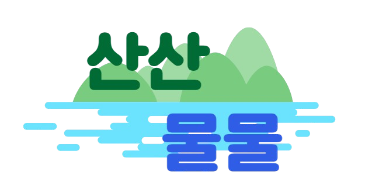

  

<h1 align="middle">산산물물</h1>
<h3 align="middle">등산의, 등산에 의한, 등산을 위한   등산 멤버 매칭 및 개인 맞춤 등산 기록 서비스</h3>

 

## :mountain: Project SanSanMulMul

등산 멤버 매칭 및 개인 맞춤 등산 기록 제공 서비스

등산, 트레킹 국민 의식 실태조사 보고서에 따르면 많은 비등산인의 등산하지 않는 이유로

1. 같이 살 사람이 없어서
2. 시간이 없어서
3. 산에 대해 잘 몰라서
4. 위험해서

위의 이유가 많은 부분을 차지했습니다.

다만 등산 등 숲길 체험 국민 의식 실태조사에 따르면 점점 등산 등을 체험한 아웃도어 인구가 많아짐에도 불구하고 위와 같은 불편함을 해소시켜 줄 서비스가 부재했습니다.

본 앱은 위와 같은 아쉬움을 해결하며, 등산을 완료하기까지 불편한 점을 해소하기 위해

1. 그룹 매칭 시스템
2. 등산 스타일 시스템
3. 이탈 멤버 감지
4. 개인 맞춤 등산 기록 제공
5. 산과 관련된 뉴스 제공
6. 산 추천 시스템
7. 산마다 5일치 날씨 예보
8. 코스 경로 안내 및 난이도 표시
9. 자주 가는 산 즐겨찾기 기능
10. 마음에 드는 멤버 팔로우 기능
11. 현재 위치 및 지도 근방 50km 산 리스트 제공
12. 칭호 시스템

의 기능을 제공합니다

## :office: Team Sansantek
> **SSAFY 11TH**   **개발기간: 2024.07 ~ 2024.08**

## :sparkles: Service Example
  + ### 0️⃣ 홈 및 산 뉴스
    + 홈에서 날짜에 따른 계절별 산 추천 (봄이면 봄 여름 가을 겨울, 여름이면 여름 가을 겨울 봄 등의 순으로)
    + 상단 뉴스 탭에서 뉴스를 누를 시 해당 뉴스 링크로 이동
    + 
  + ### 1️⃣ 지도 탭
    + 최초 실행 시 자신의 위치를 기반으로 근처 50KM 범위에 해당하는 산의 리스트를 하단 Botton Drawer에 보여주고, Naver Map에 Marker로 표시해줌
    + 마커를 누를 시 산 이름을 Tag로 보여줌
    + 지도를 직접 움직일 경우 해당 화면 영역 근처 50KM내의 산의 리스트를 보여줌
    + 
  + ### 2️⃣ 그룹 탭 및 그룹 검색
    + 나의 그룹과, 전체 그룹에 대해서 선택할 수 있는 Radio 버튼이 있고, 나의 그룹에서는 진행 중인 그룹과 완료된 그룹에 대해서 볼 수 있는 Spinner가 제공
    + 상단의 검색 탭, Spinner의 조건을 설정할 경우 각 경우에 맞는 그룹이 필터링 되어서 보여짐
    + 
  + ### 3️⃣ 그룹 신청
    + 가입 신청 버튼을 누르면 해당 방의 방장 및 등산 스타일 등 보다 구체적인 정보를 알 수 있음
    + 가입 신청을 누르면 신청 완료 다이얼로그를 보여줌
    + 만약 이미 내가 가입한 그룹과 시간이 겹치거나, 이미 신청한 적이 있는 그룹의 경우 각각의 상황에 맞는 가입 불가 다이얼로그를 띄워줌
    + 
      |그룹 신청|그룹 신청 불가 다이얼로그|
      |:---:|:---:|
      |||
  + ### 4️⃣ 그룹 신청 Notification
    + 누군가가 내가 개설한 방에 가입 신청을 누른다면 FCM을 통해 Notification을 띄워서 알려줌
    + 
  + ### 5️⃣ 그룹 가입 신청 수락 및 거절
    + 방장은 신청과 거절 버튼을 통해 멤버를 골라 받을 수 있음
    + 버튼을 누를 때마다 수락이라면 해당 유저가 바로 그룹 멤버로 반영됨
    + 
  + ### 6️⃣ 그룹 채팅
    + Stomp 방식으로 실시간 채팅을 구현함
    + 이 또한 FCM 알림이 오도록 구현함
    + 
  + ### 7️⃣ 산 검색 및 디테일
    + 홈 탭의 상단에 검색 창을 통해서 특정 산을 검색할 수 있음
    + 검색 시 나오는 산 검색 결과 창, 지도 탭의 Bottom Drawer 등 산 정보가 나오는 곳곳에서 산을 누를 시, 구체적인 산에 대한 정보를 볼 수 있는 Detail 창으로 넘어감
    + Detail 창에서 해당 산의 오늘부터 5일간의 기상 예보, 산에 대한 설명, 코스 개수, 고도, 일출, 일몰 시간, 코스 종류 및 코스 경로 등 다양한 기능을 보여줌
    + 
      |산 검색|산 디테일|
      |:---:|:---:|
      |||
  + ### 8️⃣그룹 디테일
    + 그룹 설명, 멤버 등 그룹에 대한 정보와, 상행, 하행 등산 코스에 대한 정보 및 갤러리 기능을 제공함
    + 갤러리는 자신의 사진에 한해서만 삭제가 가능함
    + 또한 그룹 신청 요청 및 방장 위임 등 이벤트에 대한 알림 목록을 제공함. 이때 사람 정보 등 특정 정보를 필터링하여 하이라이트 처리해서 보여줌
    + 
      |그룹 디테일 및 사진 첨부|그룹 갤러리|알림 목록|
      |:---:|:---:|:---:|
      ||||
  + ### 9️⃣마이 페이지
    + 내 닉네임, 프로필 사진, 칭호, 정상석 인증 리스트 등을 확인할 수 있음
    + 또한 등산 History 조회 시 내가 움직였던 동선을 보여주며, 같이 참여했던 멤버들을 눌러서 멤버들의 프로필 탭으로 접근 및 팔로잉 가능
      |마이페이지, 정상석, 팔로잉 팔로우|프로필 수정|즐겨찾기|
      |:---:|:---:|:---:|
      ||||
  + ### 🔟등산 기록
    + 시간이 되면, 등산 기록 탭에서 방장은 QR이 생성되고, 그룹의 멤버는 QR을 찍어서 등산 기록 시작
    + 등산 시작을 누르면 기록이 시작되고, QR을 찍은 멤버들 간 위치가 공유됨
    + 이 때 혼자서 200m 이상 이탈된 멤버가 있다면 전체에게 FCM 알림 및 이탈 다이얼로그가 생성됨
    + 또한 나의 등산 기록은 시간별 위치가 Android 내부 Room에 저장되어 추후 마이페이지의 등산 History에서 나의 동선을 확인할 수 있음
    + AI를 통한 정상석을 판별하는 기능을 통해 정상에 올랐을 때 정상석을 인증할 수 있는 기능 제공 및 추후 마이페이지의 My 정상석 탭에서 인증된 정상석 확인 가능
    + |방장 QR|멤버 위치 제공 및 이탈 감지|정상석 인증|
      |:---:|:---:|:---:|
      ||||

  
## 👩‍💻👨‍💻 Member <!-- 깃허브에선느 :pouting_man: :pouting_woman:-->
    |윤가희|노나현|박태우|신영민|정민선|곽대건|
    |:---:|:---:|:---:|:---:|:---:|:---:|
    |**Team Leader / BE**|**BE / CI,CD**|**BE**|**FE**|**FE / UI,UX**|**FE**|
    | yungahee99@gmail.com| hyunstu16@gmail.com| twey163@gmail.com| 2525sym@gmail.com| alstjs1516@gmail.com| eorjs7578@gmail.com|

 

## :date: Milestone
  

## :book: Stack
  + ### :computer: Back Tech Stack
    
    
    
    
    
    
    

  + ### :iphone: Android Tech Stack
    
    
    
    
    
    
    
    
    
    
    
    
    
    
  + ### :art: UI/UX
    
    

    
  + ### :desktop_computer: CI/CD
     
    
  + ### :dart: Platform
    
  + ### :keyboard: IDE
    
    

  + ### :black_nib: Office
    

  + ### :loudspeaker: Communication
      
      
  
  ## ⚙ Architecture
  

  ## :open_file_folder: Git Branch Strategy
  + ### :bookmark_tabs: 종류
    + #### Master
      검증 완료 및 최종 배포 브랜치
    + #### Develop
      개발 완료 및 검증 미완료 브랜치
    + #### FrontEnd
      Front(Android) 코드 브랜치
    + #### BackEnd
      Back-end 코드 브랜치
    + #### Other(기능 별 별도의 이름의 Branch)
      Front, Back 각각의 세부 기능들을 나눈 Branch

      + ##### FE/~
        Front End의 Feature별 브랜치
      + ##### BE/~
        Back End의 Feature별 브랜치

        ex:) Front의 A라는 기능의 Branch면 FE/A branch
    
  + ### 🧾 Flow <!--깃허브에서는 :receipt: 아이콘으로-->
    **Other** => **Front/Back** => **Develop** => **Master**
    
  ## :label: External Link
    + [Team Notion](https://www.notion.so/D111-f5fd36452f8d45da86aada62fde4b305)
    
    + [WireFrame](https://www.figma.com/design/p9QVBiLHZrebHPqpGt4sly/Wireframe?t=JOOE26FbI7fbxCuL-0)
        > 
    + [ProtoType](https://www.figma.com/design/gAoSFIFu7YtqJvNz50waCD/Prototype?t=urpxt2hfen2dCOTo-0)
        > 
    + [Jira](https://ssafy.atlassian.net/jira/software/c/projects/S11P12D111/boards/7062?assignee=unassigned&assignee=712020%3A5730f3a2-c4cb-41f5-b48b-bcc6e9c5a67c)
    + [ERDCloud](https://www.erdcloud.com/d/xbCpx4Atcj3twdwqi)
    + [GitLab](https://lab.ssafy.com/s11-webmobile4-sub2/S11P12D111)

