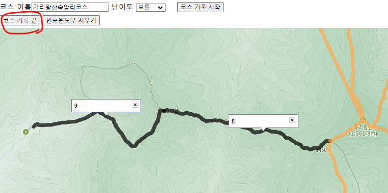

# 🛤 등산 코스 생성 프로그램
산림청에서 받아온 끊어져 있는 등산 경로 데이터(구간 데이터)를 연결하기 위해<br>카카오 지도 api를 활용하여 **구간 데이터들을 시각화**하고<br>
클릭하여 연결 후 완료 버튼을 누르면 **SQL문을 생성**해서 DB에 있는 **course테이블에 코스 정보를 추가**하는 산산물물만의 프로그램을 추가 구현하여 사용했습니다.

1. **DB정보 설정**

    본인 DB 정보에 맞게 수정해서 사용한다.
    ```
    const conn = {  
        host: 'localhost',
        port: '3306',
        user:'ssafy',
        password: '1234',
        database: 'test'
    };
    ```
2. **실행방법**
    ```
    npm i
    node app.js
    ```
3. **산 구간 검색**

    ```산 코드```(산림청 데이터, mountain테이블에 존재) 입력 후 ```Select문 실행``` 클릭

    * 결과화면 :

        </img>


4. **코스 정보 입력**

    </img>

    ```코스 이름``` 입력 ,  ```난이도``` 입력 --> ```코스 기록 시작``` 클릭


5. **구간 클릭해서 코스 생성**

    </img>

6. **코스 완성 후**

    </img>

    ```코스 기록 끝``` 클릭
    * 참고

        * 콘솔창

            </img>

            : DB에 넣는 INSERT문과 성공여부 확인 가능
        
        * DB

            </img>

            : DB에 들어간 코스 데이터

    **==> 💾 DB에 코스 정보 저장 완료 💾**


7. ```인포윈도우 지우기``` **클릭**
    
    
